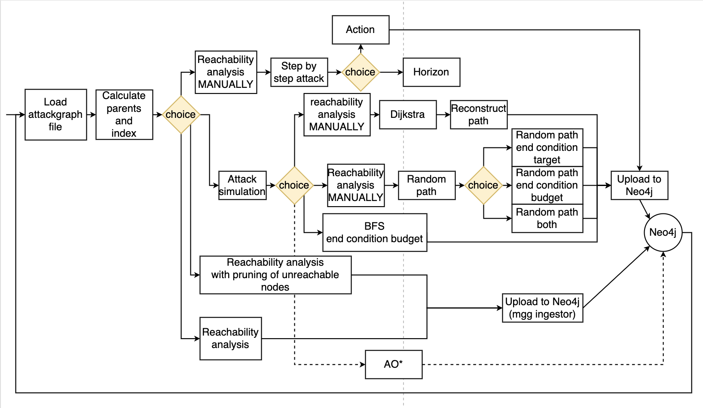

#### Tool for attack simulations on coreLang attackgraphs generated by mgg-toolbox.
This is an interactive tool for running attack simulations on the mgg-generated attack graphs.
The mal-toolbox repository is found at https://github.com/mal-lang/mal-toolbox/.

#### Installation
Clone this repository:
```sh
git clone https://github.com/beatajoh/mgg-project
```
#### Virtual environment
Set up a virtual environment with all necessary dependencies, found here https://github.com/mal-lang/mal-toolbox/blob/main/requirements.txt.

```sh
python -m venv env
source env/bin/activate
pip install -r requirements.txt
```
**Note:** You need a Python version >= 3.9, the latest the better.

#### Set up the Neo4j database
We need an open Neo4j instance running with a database
with the following credentials:

- username: neo4j
- password: mgg12345!
- dbname:   neo4j

Note that the Neo4j project name and the DBMS name used within
the project are irrelevant, the most important thing is that
the password matches as the username and specific database
name are set to default values.

#### Usage
Open the terminal, navigate to the mgg-poject directory "simulations", and run:
````
python main.py
````
This flowchart shows the workflow of the interface (NOTE: Not yet updated, since the reachability analysis is not included in this updated version):


#### What does the attack simulations do?
* **Step by step attack** - Simulate the attack path from the attacker node by manually choosing which nodes to move forward to.
* **Shortest path Dijkstra** - Get the shortest path from the attacker node to a target attack step.
* **Random path** - Get a random path of attack steps. It is possible to search for a target attack step and adding a cost budget for the attacker. It is also possible to just specify the target or only use an attack budget without a target. 
* **BFS** - Get a subgraph where all nodes are within the cost budget of the attacker. Note that the attack step type is not considered.

#### Example to get started
1. Activate the venv.
2. Run the interface with ````python main.py````.
3. Now you can choose the *step-by-step* attack option, or any of the graph algorithms.
4. Open the main.py file and look at the comments where some example targets are suggested.
5. Note: The attacker and its entry points for all simulations are fixed in the code and this will be necessary to modify later.
   
#### TODO
* Add AO* to the rest of the code.
* Add more node properties and labels to show Neo4j.
    * ...by modifying the upload_graph_to_neo4j function in main.py.
* Show the result path together with the attack graph and asset graph in Neo4j (because right now the paths are displayed separately)
* Error handling on user input.

